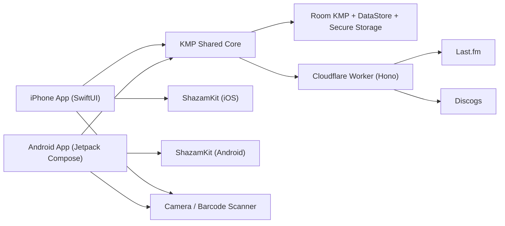

# Architecture

This document owns system boundaries, data ownership, and runtime topology. Concrete library and tool choices live in [Stack](stack.md).

## Objectives

- Share domain and integration logic across iPhone and Android.
- Preserve native UX for camera, microphone, background lifecycle, and deep-link flows.
- Keep provider tokens and listening data local to the device.
- Use a stateless `Cloudflare Worker` only for provider callbacks, signed Last.fm calls, and Discogs proxy requests.
- Keep GitHub as the public control plane for review, build, deploy, release, and production verification.

## System Overview

## Client Structure

### Shared KMP Modules

- `shared:domain`
  - core entities such as `ListeningSession`, `DiscogsRelease`, and `QueuedScrobble`
- `shared:auth`
  - integration token parsing, auth payload handling, and secure-storage coordination
- `shared:catalog`
  - Discogs collection sync, search indexing, cache freshness enforcement, barcode result normalization
- `shared:session`
  - track progression rules, side and disc transitions, confidence handling, manual overrides
- `shared:scrobble`
  - now playing state, scrobble eligibility calculation, queue ordering, retry policy
- `shared:persistence`
  - local persistence orchestration, secure key storage interfaces, and migration strategy
- `shared:network`
  - provider-facing HTTP abstractions
- `shared:di`
  - shared service assembly for iOS, Android, and tests

### Native iPhone App

- native iPhone UI layer
- native deep-link handling
- microphone permission and audio capture bridge to ShazamKit
- camera permission and barcode scanner integration
- Keychain-backed secure token storage adapter
- lifecycle handling for foreground session state

### Native Android App

- native Android UI layer
- app link or deep-link handling
- microphone permission and ShazamKit Android bridge
- camera permission and barcode scanner integration
- Android keystore-backed secure token storage adapter
- lifecycle handling for foreground session state

## Backend Structure

The backend is a stateless Worker runtime. The selected implementation stack is defined in [Stack](stack.md).

### Responsibilities

- start provider auth flows
- complete provider callback exchanges
- sign Last.fm write requests with server-side API secret
- proxy Discogs user and collection reads over HTTPS
- normalize provider errors into app-safe responses

### Non-Responsibilities

- no user account system
- no durable database for user profile or listening history
- no storage of raw audio, fingerprints, release selections, or play logs
- no background jobs for retry or sync
- no production deploy path outside `GitHub Actions`

## Data Ownership

### On Device

- Last.fm session key and Discogs OAuth token pair
- active session state
- local play history
- queued scrobbles and retry metadata
- Discogs collection cache and search index

### Backend, In Transit or Memory Only

- short-lived auth context during browser callbacks
- provider tokens present only during request handling
- request signing material held as backend secrets
- deployment credentials and provider app secrets controlled through protected GitHub environments and injected into Cloudflare Worker secrets during deploy workflows

## Session Engine Rules

- Sessions are foreground-first; recognition runs only while the app is active.
- A session is always tied to one selected Discogs release.
- Matching logic works inside a bounded window around the expected track plus next plausible side or disc start.
- Strong matches can auto-progress.
- Weak or conflicting matches require user confirmation before the timeline changes.
- Manual side or disc changes override recognition expectations immediately.
- The scrobble queue remains authoritative even if the UI session is interrupted.

## Cache and Freshness Policy

- Discogs collection data is cached locally with a maximum display freshness of six hours.
- If the cache is stale, the app must refresh before showing the full collection browser or starting a new session from library data.
- Active sessions may continue from already loaded data, but the next browse action must refresh stale collection content first.

## Failure Model

- Auth failures are recoverable and restartable from onboarding or settings.
- Discogs sync can resume page by page after partial failure.
- Recognition failure never deletes session state.
- Scrobble failures are classified as recoverable or terminal and persisted locally.
- Backend outages should degrade the app into a read-only local state rather than erase tokens or queue data.

## Delivery Architecture

- Source control, pull requests, deployment records, releases, and provenance metadata live in a public GitHub repository.
- Delivery and provenance rules are owned by [CI/CD and Provenance](ci-cd-and-provenance.md).
